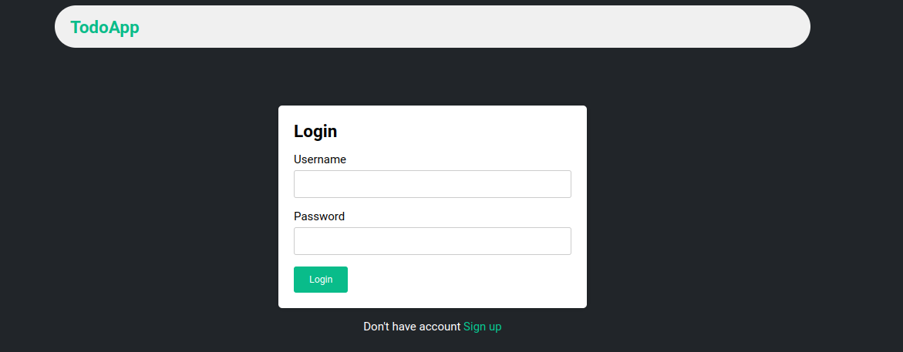

## Todo List

## Table of Contents
- [Features](#features)
- [Installation](#installation)
- [Technologies](#-technologies)

## Features

- User authentication and authorization to keep your data secure
- Once logged in, users should be able to create multiple to-do lists.
- Users should be able to add tasks to each to-do list.
- Create, edit, and delete tasks
- Mark tasks as completed or incomplete
- Edit the name of a to-do list.
- Delete a to-do list.

## 🔨 Technologies

### Languages

### Frontend

### Deployment

